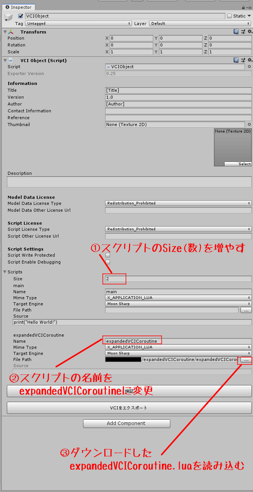

# expandedVCICoroutine

# 概要
VCIのスクリプトで利用可能なコルーチン機能を拡張したモジュールです。

## 追加機能
* コルーチン実行時の引数指定

# ダウンロード
[ダウンロードページ](https://github.com/chinng-inta/expandedVCICoroutine/releases)

# 導入方法
VCI ObjectがアタッチされたモジュールのScriptで以下の操作を行う。

1. スクリプトのSize(数)を増やす
2. スクリプトの名前をexpandedVCICoroutineに変更
3. ダウンロードしたexpandedVCICoroutine.luaを読み込む

# API reference

## startCoroutine(func, ...)
|関数名|startCoroutine|
|---|---|
|説明|指定された関数を本体とするコルーチンを作成 関数の引数を指定可能|
|引数|func コルーチンの本体関数 ... 本体関数funcの引数(option)|
|戻り値|なし|

## updateCoroutine
|関数名|updateCoroutine|
|---|---|
|説明|startCoroutineで開始したコルーチンについて、実行が中断されているものについて、実行を再開する VCIコールバックのupdate()やupdateAll()から実行してください|
|引数|なし|
|戻り値|なし|

詳しい使い方については、
* 付属のexpandedVCICoroutine.unitypackage
* [THE SEED ONLINEに投稿されているアイテム](https://seed.online/products/05d34e1e6895854235f73c4981ca7297da6267e6c6acf5105ebda5e8b66e10e0)を参照してください

を参照してください。

# 連絡先
twitter : https://twitter.com/chinng_inta

# 更新履歴

| version | date       | detail  |
| ------- | ---------- | -------- |
| v1.0.0  | 2020/05/05 | 初版公開 |

# 免責事項
本モジュールはフリーソフトであり、バグ等についても修正する義務を負わないものとします。
また、本モジュールを使用したことによるデータの破壊等の責任は負わないものとします。

## License
MIT